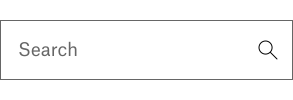

# Exercise 1 - User interface

Build an user interface that matches the design below.



:trophy: Create a component with styling to match the design.

Keep in mind:

- Response layout. The layout should work for both desktop and mobile devices.
- Accessibility
- Icons are located in the `src/assets/` folder

## Run the code

We have provided you with a npm script to run the React application:

```
npm start
```

> Remember to run `npm install`
