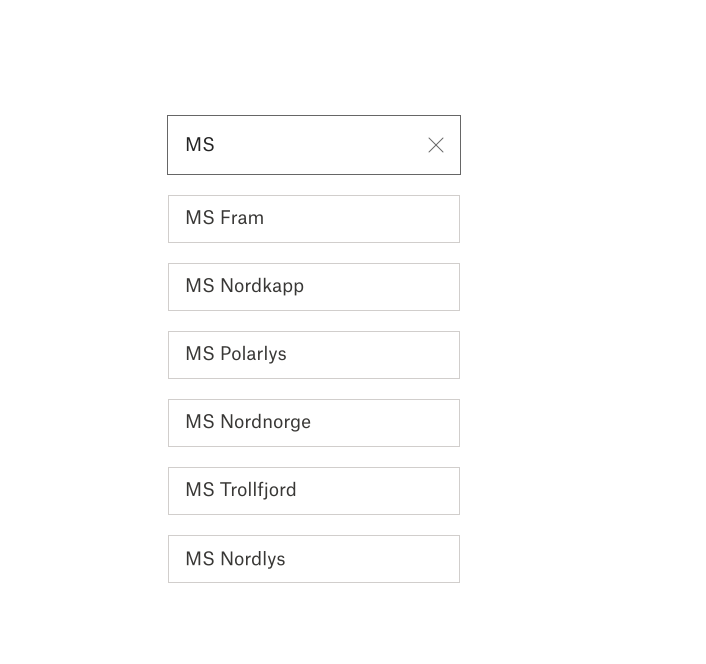

# Exercise 3 - Search

For this exercise we have created a backend API that returns a list of Hurtigruten's ships. When the server is running you can query the `/api/ships` endpoint. If you want to find ships with a name that contains `amundsen` you can provide the search query as an url parameter:

```
curl -s http://localhost:4000/api/ships/amundsen
```

:trophy: Extend your application to perform a search when the user presses enter. List the result below the search bar, as shown below.




## Troubleshooting

If your server is not running, use this npm script to start it:

```
npm run server
```

The server should now be running on http://localhost:4000
